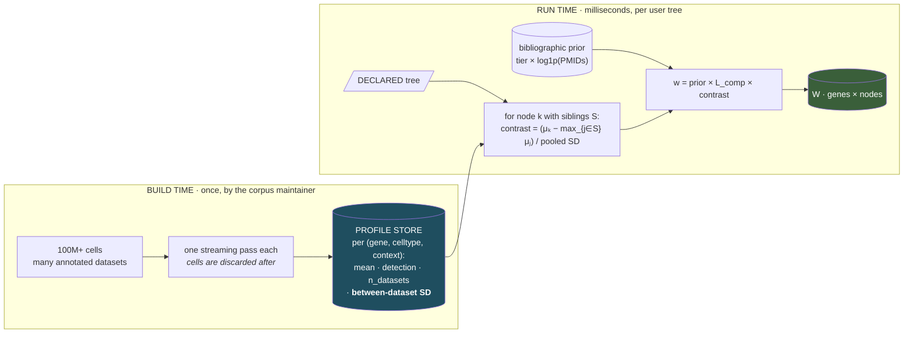
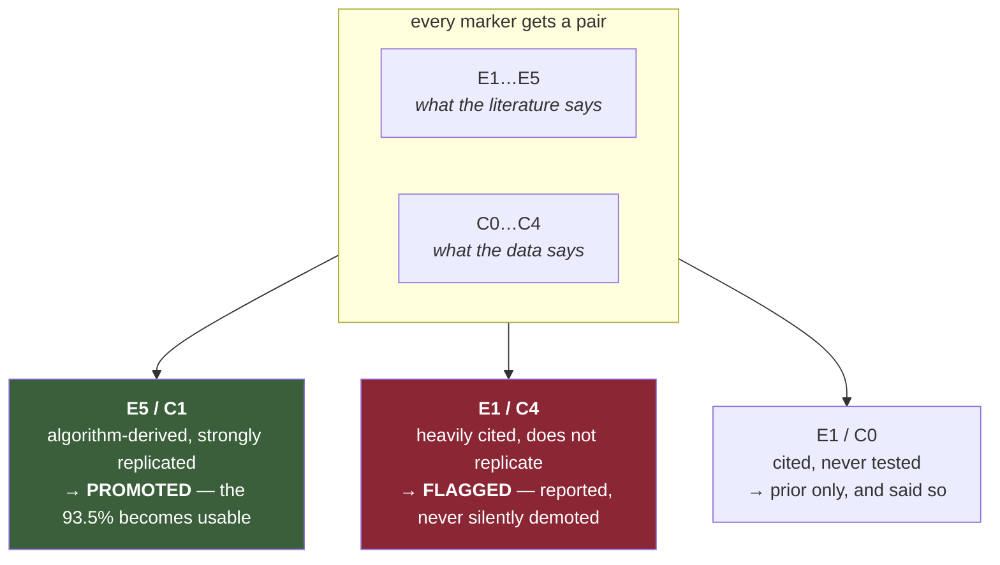
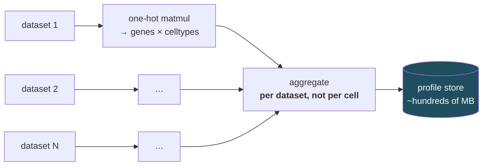

# Conditional weights and marker promotion

How the marker corpus is calibrated against atlas data at scale — the weight a marker carries, and
how a computation-derived assertion earns one.

Companion to [CLASSIFIER.md](CLASSIFIER.md). This document specifies `scanno calibrate`,
which is **built** — see the command below and `tests/test_calibrate.py`. The leave-one-context-out
validation in [TRAINING.md](TRAINING.md) is not.

```bash
scanno calibrate --manifest atlases.tsv --db corpus.db --tree tree.json \n                 --species Human --tissue Blood --out calib/
```

The manifest is a TSV of `path, source_id, label_key, provenance`. Datasets that do not share a
gene space are **refused** unless `--harmonise` is passed, and the intersection is then reported
and floored at `--min-shared-genes`: silently intersecting would make the store's coverage depend
on which atlas loaded first.

---

## 1 · The two defects being fixed

**The weight is bibliometric.** `tier × log1p(n_pmids)` records how much the literature asserts a
marker and nothing about whether it separates cells. It is also *unconditional*: `Acta2` carries
one weight for `Fibroblast` whether it is being asked to distinguish fibroblast from myofibroblast
(where it is useless) or from lymphocyte (where it is excellent).

**93.5% of the corpus is thrown away.** Tier 5 — *"a marker detector ran; no paper asserts it"* —
is the large majority of any tissue slice and is currently weighted **zero**. That was justified
by count, not by correctness: those markers are *unvalidated*, not *false*. They are the output of
COSG, CelliD, FindAllMarkers, Cepo, SEMITONES and Spapros run over real data.

The second defect is the opportunity. **Tier 5 says no paper asserts this. Atlas evidence can
supply what a paper would have supplied.** At 100M cells the corpus's algorithm-derived bulk stops
being dead weight and becomes the candidate pool.

### The pool, measured

| | |
|---|---|
| assertions currently scored (tier ≤ 4) | **142,261** |
| assertions currently **zeroed** (tier 5) | **989,484** |
| …of those, in a real gene reference | 864,437 |
| ratio | **7× the scored corpus is idle** |

And the ratio is wildly uneven across the 96 well-covered contexts, which is what turns this from
an optimisation into a capability:

| context | scored | tier-5 pool | |
|---|---|---|---|
| Human Blood | 7,619 | 52,287 | 7× |
| Human Lung | 6,117 | 54,384 | 9× |
| Human Liver | 4,573 | 36,605 | 8× |
| Human Intestine | 3,305 | 39,724 | 12× |
| **Human Colon** | **921** | **42,665** | **46×** |

**Human colon has 921 curated assertions for an entire tissue.** That is too thin to annotate
against, and no amount of better scoring fixes it. Its 42,665 algorithm-derived candidates are the
only path to a usable colon panel. Promotion is not a marginal gain in the well-curated contexts —
it is the difference between the tool working and not working in the poorly-curated ones, which
are most of them.

---

## 2 · The constraint that decides the architecture

The obvious design — learn a weight per `(gene, celltype, sibling-set)` — **cannot be
precomputed**, because the sibling set comes from a tree the *user* declares at runtime. There is
no bounded index to enumerate.

So the split is:

> **Precompute what is tree-independent. Derive the contrast at runtime.**



The profile store is **tree-agnostic**: it records how each cell type expresses each gene, not how
well it beats some particular competitor. Any tree can then be weighted against it, including one
nobody had thought of when the calibration ran. The runtime step is a max over sibling columns and
a subtraction — vectorised, and it does not change the classifier's cost.

---

## 3 · The profile store

One row per `(context, celltype, gene)`. Context is the **mandatory triple**:

| axis | from | why it must be conditioned on |
|---|---|---|
| **species** | corpus | already carried; `Myh6` inverts between human and mouse |
| **tissue** | corpus | a macrophage in heart is not a macrophage in lung |
| **assay** | *new* | **single-cell vs single-nucleus.** Nuclear transcriptomes are systematically different; a marker calibrated on 10x scRNA may fail on snRNA — and uncorrected, that lands as a technical gradient on whichever design arm differs in chemistry |

```sql
context (context_id, species, tissue, assay)
dataset (dataset_id, name, doi, n_cells, assay, tissue, species,
         label_provenance)          -- see §6
profile (context_id, celltype_id, gene_id,
         mean_z,                    -- mean of WITHIN-DATASET z-scored expression
         detect_rate,
         n_cells, n_datasets,
         between_dataset_sd,        -- the replication term; §5 lives on this
         n_datasets_clean)          -- datasets whose labels are not marker-derived
```

`mean_z` is averaged over **within-dataset** z-scores rather than raw values, so a dataset's depth
and normalisation cannot shift the pooled mean. `between_dataset_sd` is the quantity that makes
replication measurable and is what separates a real marker from one dataset's artifact.

---

## 4 · The runtime contrast

For declared node `k` with sibling set `S` (the children of the same parent, `k` included):

```
μₖ   = max over the corpus celltypes that map to k        (MAX pooling, as in the classifier)
μ_S  = max over j ∈ S \ {k} of μⱼ                          the best competitor, not the mean
d    = (μₖ − μ_S) / sqrt(sdₖ² + sd_S² + ε)                 a cross-dataset effect size
contrast = clip(1 + a·d,  0.1,  4.0)
```

Three choices worth stating:

- **The competitor is the maximum sibling, not the average.** A marker that beats four siblings and
  ties the fifth cannot make that distinction, and averaging hides it.
- **The denominator is between-dataset SD**, so a gene with a large but irreproducible gap is
  discounted automatically. Replication is built into the effect size rather than bolted on.
- **The floor is 0.1, not 0.** A marker that fails to discriminate at *this* level is still a
  marker of the parent, and will be scored again at the level where it does discriminate.

**A prediction worth testing, not a claim:** this should also fix the dilution failure that the
coverage term did not
([CLASSIFIER.md](CLASSIFIER.md) §4–5). A heterogeneous `Lymphoid` node's
weight would concentrate on genes that actually separate lymphoid from myeloid, rather than
spreading over 96 markers most of which discriminate T from B. That is exactly the failure that
mislabelled a B-cell cluster, and it should be measured before being believed.

---

## 5 · Promotion — the C ladder

**The bibliographic ladder E1–E5 is never mutated.** A computationally-promoted marker and a
twice-published one are both trustworthy and they fail *differently*: algorithm-derived markers
inherit the biases of the detector that produced them and of the data it ran on. Collapsing them
into one number destroys the only signal that says which kind of trust applies.

So calibration adds an **orthogonal** ladder, and every marker carries both:

| | computational evidence | requires |
|---|---|---|
| **C1** | **replicated** | effect size above threshold in **≥5 independent datasets**, of which **≥3 label-clean** (§6) |
| **C2** | supported | ≥3 datasets, ≥1 label-clean |
| **C3** | observed | ≥1 dataset |
| **C4** | **tested and failed** | measured in ≥3 datasets, effect size ≈ 0 |
| **C0** | **not measured** | absent from every atlas in the calibration set |

**C0 and C4 are different and must never merge.** Never-measured is not measured-and-failed —
principle 4 again, and the distinction is the whole value of the ladder.

### The two cells of the cross-table that justify the design



**E5/C1 is the mechanism you asked for.** A marker no paper asserts, which discriminates its cell
type from its siblings across five independent datasets, has earned evidence — just not
bibliographic evidence. It is promoted, and the record says *how*.

**E1/C4 is the more valuable output.** A heavily-cited marker that does not replicate across 100M
cells is a finding about the literature, and this is the only design that can produce it. It is
**reported, never silently demoted** — see §7.

### Tier 5 must stop being hard-zero

Promotion is impossible if the prior is zero, because zero times anything is zero. So the
bibliographic prior changes:

```
tier 1..4  →  8, 4, 2, 1        unchanged
tier 5     →  0.25              a floor, not zero — promotable, but starting far below a
                                 single published assertion
```

A C1-promoted tier-5 marker reaches `0.25 × 4.0 = 1.0` — parity with a *single* tier-4
publication, never with a replicated tier-1. That ceiling is deliberate.

---

## 6 · Circularity is the main threat, and it gets worse at scale

Most public atlas labels are themselves marker-derived, and many were assigned using CellMarker.
Learning weights from those labels measures **agreement with prior practice, not truth** — and at
100M cells the loop closes harder, because volume looks like confirmation.

**Holding out cells does not break the loop. Holding out datasets does**, and even that is not
enough if every dataset was annotated the same way.

So every dataset carries a declared `label_provenance`, and it gates promotion:

| provenance | example | counts as label-clean? |
|---|---|---|
| **sorted / genetic** | FACS gates, lineage tracing, hashing | **yes** — a different measurement modality entirely |
| **multimodal** | CITE-seq protein, ATAC | **yes** |
| **expert-curated** | manually annotated, markers not from this corpus | partial — declared, counted separately |
| **marker-derived** | annotated by CellTypist/corpus lookup | **no** |
| **unknown** | provenance not recorded | **no** — never assumed clean |

**Promotion requires ≥3 label-clean datasets.** Marker-derived datasets may contribute to the
profile and to C3, never to C1. Unknown provenance is treated as marker-derived, because an
unrecorded provenance that defaults to clean is exactly how a circular result would enter.

The PBMC test already in the record ran this way by luck rather than design: `pbmc68k`'s
`bulk_labels` are FACS-sorted populations, and atlas evidence reversed an ordering error the
citation prior had backwards.

---

## 7 · A weight change is a decision, and demotion is bounded

Changing a weight is not neutral. Driving one to zero removes a marker from every future
annotation, and the removal is invisible in the output.

| | bound | why |
|---|---|---|
| **demotion** | `L ≥ 0.25`; **never 0** | the markers most at risk are the rare, lightly cited ones that are nonetheless the only validated marker for their type. An unbounded fit deletes exactly those. |
| **promotion** | `L ≤ 4.0`, and E5 starts at 0.25 | a promoted algorithm-derived marker must never outweigh a replicated published one |
| **demotion below the prior** | **reported, not applied** | an E1/C4 marker keeps its prior weight and is *flagged*. The tool states the contradiction; it does not resolve it by deletion. |

That last row is the important one. The temptation at 100M cells is to let the data overrule the
literature automatically. But a marker that fails to replicate may be failing because every atlas
in the set shares an assay bias — and a silent demotion is indistinguishable from a discovery.
**Report the disagreement; let a human decide.** Every weight change is written to a calibration
ledger with the datasets that drove it, readable without the tool installed.

---

## 8 · Scale — 100M cells

The design is cheap because **the cells are never needed twice**.



Per dataset: the same sparse one-hot multiply the classifier already uses — `O(nnz)`, one pass,
output `genes × celltypes` and the cells are discarded. Embarrassingly parallel across datasets;
nothing is ever held jointly. 100M cells reduce to a store measured in hundreds of megabytes.

### Two statistical rules that only matter at this scale

**Aggregate per dataset, never per cell.** With 100M cells every effect is significant and one
5M-cell atlas would outvote two hundred small studies. This is the pseudobulk lesson stated for
differential expression — *aggregate to the donor level, otherwise p-values reflect cell count
rather than biological replication* (doi:10.1161/circulationaha.119.045401) — applied to
calibration. A dataset is one vote, and its weight is capped regardless of size.

**Never threshold on significance.** At this n, a p-value is a statement about sample size.
Promotion is decided on **effect size and cross-dataset replication**, and the C ladder counts
datasets rather than cells for exactly that reason.

---

## 9 · What ships

Atlases are consumed at build time. What ships is the profile store and the calibration table —
`(context, celltype, gene) → mean, sd, n_datasets, C-grade`. Numbers, not data; the same pattern
CellTypist uses to distribute models without distributing what trained them. The constraint from
the constraint holds: **scAnno ships no reference dataset.**

---

## 10 · What must be measured before any of this is believed

- **Does the contrast term fix dilution?** §4 predicts it should. Untested. The controlled
  incoherent-node experiment already exists and can be re-run against it.
- **How much does assay conditioning matter?** Whether sc-calibrated weights degrade on snRNA is
  the question that decides whether a mostly-single-cell calibration can serve single-nucleus data at all.
- **What are the C1 thresholds?** "≥5 datasets, ≥3 clean" is a proposal, not a measurement. The
  right values come from a held-out set of datasets with sorted labels.
- **How many tier-5 markers actually promote?** If it is a handful, the mechanism is not worth the
  machinery. If it is thousands, the corpus roughly triples in usable size.
- **How many tier-1 markers land in C4?** The most interesting number in the design, and nobody
  has it.
