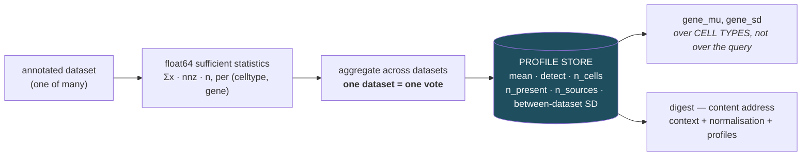
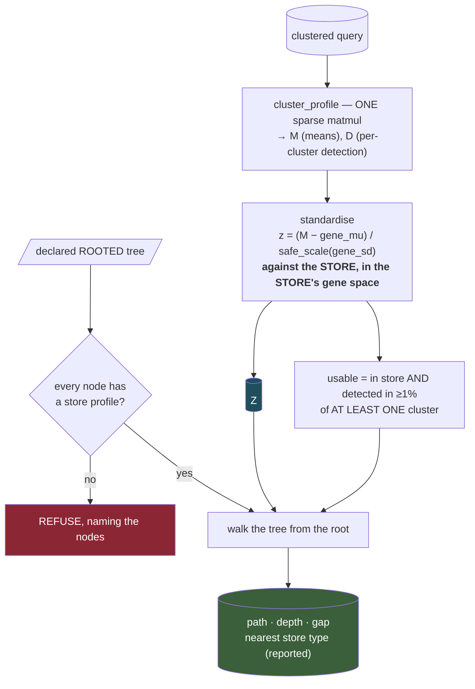
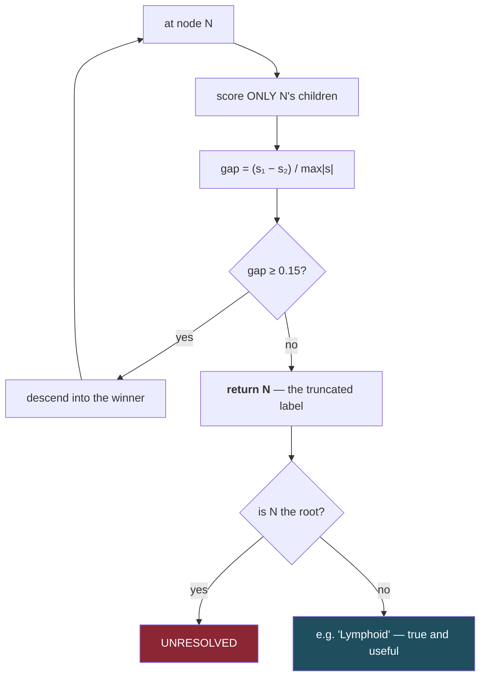
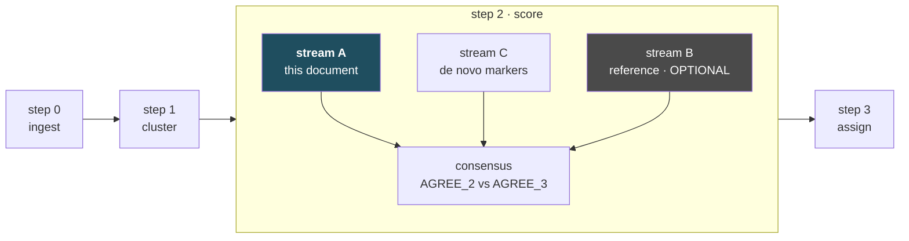

# The classifier — current design

How scAnno turns a clustered query into labels: the score, the rooted walk, and the two
weight sources. Companion to [PRINCIPLES.md](PRINCIPLES.md) (the rules the code enforces) and
[CALIBRATION.md](CALIBRATION.md) (how the profile store learns).

Status: validated on PBMC. Step 2 of four; see [KNOWN_ISSUES.md](../KNOWN_ISSUES.md).

---

## 1 · Where it stands

| | pbmc3k (store built from it) | pbmc68k (independent, FACS labels, 765 genes) |
|---|---|---|
| **8 populations** | 8 exact · 0 wrong | — |
| **10 populations** | — | 8 correct · 2 abstained/truncated · **0 wrong** |

The independent set has different donors, different processing, 765 genes instead of 13,714, and
labels from **FACS gates** rather than transcriptomic inference. `gap_min = 0.15` was fixed before
that test and never changed.

Runtime: **~0.2 s** end to end on 2,638 cells.

---

## 2 · The architecture in one line

> **The store learns; the classifier is a fixed function.**

```
classify : (query counts, profile store, declared tree) → labelled clusters
```

A pure function of three inputs. It has no parameters fitted at runtime, so a result is
reproducible given the store digest and the tree — and every failure is attributable to one of the
three inputs rather than to a training state nobody can see.

---

## 3 · Build time — the profile store

One streaming pass per dataset. **Cells are discarded; only statistics survive.**



| rule | why |
|---|---|
| **entry at ≥10 cells; "present" for grading at ≥50** | the two thresholds were once one. At 50 it excluded the two rarest PBMC types from the store entirely and both were then confidently mislabelled — the rare-population bug, inside the fix for the rare-population bug. |
| **one dataset = one vote** | a 5M-cell atlas must not outvote two hundred small studies |
| **float64 accumulators** | float32 over 10¹¹ nonzeros loses precision silently |
| **`gene_mu` / `gene_sd` computed over cell types** | this is the standardisation vector §4 depends on, and it must not come from the query |

**C ladder** — grades *profile replication*, tree-free: `C1` ≥5 independent sources · `C2` ≥3 ·
`C3` otherwise · **`C0` = no profile at all**, which is not the same as a weak one.

---

## 4 · Query time



### `Z` — standardised against the store

```
Z[c, g] = ( mean_expr(c, g) − gene_mu[g] ) / safe_scale( gene_sd[g] )
```

**Nothing in this depends on which other clusters are present.** That is the point: standardising
against the run's own clusters made a label depend on what else was sequenced — deleting 2% of an
object shifted every score by a median 19.4% and flipped a call. Against the store it is 5.9% with
no flips, and the residual is only the gene set moving.

Two further rules, each from a defect:

- **`usable` requires detection in ≥1% of *at least one cluster*, never of all cells.** A
  dataset-wide floor cannot be cleared by a population smaller than the floor, so it deleted rare
  types by construction.
- **`Z` is returned in the *store's* gene space.** It was returned in the query's, while every
  consumer indexed by the store's. Those coincide only when the query carries exactly the store's
  genes — true of a self-test, false of every real query.

### The tree walk — descend, or truncate



**Truncation, not abstention, is the failure action.** A flat classifier with a reject option was
implemented here once; it scored 4/8 where its own argmax scored 7/8, because when T cell and NK
cell are genuinely close the honest answer is `Lymphoid`, not "no idea". The tree must be **rooted**
for that to be expressible — a forest of leaves has nowhere to truncate to.

The gap is the only gating statistic, and it is the only one that earned the right: **AUC 0.86**
against correctness, where the softmax posterior it replaced was *anti*-correlated.

### Weights, per sibling set

Computed at runtime because they depend on the contrast, which depends on the declared tree.

```
μₖ      pooled profile of node k     — TRIMMED: 2nd-highest across members when ≥3,
                                       max otherwise; only members graded ≥C3
μ_S     best competing sibling       — trimmed likewise when ≥4 siblings
d       (μₖ − μ_S) / safe_scale(·)
w       clip(1 + d, 0.1, 4.0) × evidence
W       w / FULL evidence mass       — not the surviving mass
```

Three of those five lines exist because of a measured failure:

- **Trimming, not max.** Max is the least robust aggregator available: one mislabelled corpus entry
  enters at full strength.
- **`clip(..., 0.1, ...)` — no negative evidence.** Tested by sweeping the floor below zero: it
  costs **2 errors on independent data and is invisible on the self-test** (identical 8/0/0 at
  every setting). Positive evidence is robust — seeing a marker means it is there. Negative
  evidence is fragile — not seeing one usually means it could not be seen.
- **Normalise by FULL mass.** Normalising by the mass that *survived* the query's gene coverage
  rescaled a depleted node back to full weight. pbmc68k contains none of `PPBP`, `PF4`, `ITGA2B`,
  `GP9`, `TUBB1`, so the megakaryocyte column lost every real marker and was rescaled onto
  housekeeping genes — and CD34+ progenitors won it. Against the full mass, an unobservable node
  scores near zero, which is what "we cannot see this type's evidence" should mean.

---

## 5 · What is deliberately absent

Each of these was built, measured and removed. Listing them is not history — it is a specification
that they must not come back without new evidence.

| removed | measured outcome |
|---|---|
| **coverage term `⊙ C`** | did not fix the dilution it was designed for; identical failure with it on and off |
| **softmax posterior + entropy gate** | discarded 3 correct calls to catch 1 error; 7/8 → 4/8 |
| **permutation null** | every p pinned at the 1/(B+1) floor; confirms signal exists, cannot discriminate labels |
| **novelty gate (correlation)** | rejected 4 real populations on independent data, and scored the one genuinely novel type *more* distinctive than real ones |
| **negative weights** | 2 errors on independent data, invisible on the self-test |
| **node-coherence gate** | its statistic depends on which other nodes exist — the same composition-dependence it was added alongside a fix for |

**Five proposed additions have measurably made this worse.** Every improvement has come from fixing
a mechanical defect or deleting a component. The standing rule that follows:

> **No statistic gates an output until it has been shown to separate correct from incorrect calls
> on held-out data, reported as an AUC beside the gate it justifies.**

---

## 6 · Where it sits in the pipeline

Stream A of step 2. It is not the pipeline and not the deliverable.



**There is no design-differential gate, and one was removed rather than shipped.** A check on the
UNRESOLVED rate per arm of an experimental design was specified here and carried over from a
sibling QC tool by analogy. On its first run against real data it returned REFUSE on a diet
comparison where **94% of the unresolved nuclei sat in two libraries of ten** — three of five
samples in the "affected" arm were at zero. A rate computed per arm is dominated by whichever
libraries inside it happen to fail, and a materiality floor does not catch that, because the arm
clears the floor on the strength of those same libraries.

It never predicted correctness and was never shown to. That is the fifth component in this design
removed for the same reason (§5), and the standing rule in [PRINCIPLES.md](PRINCIPLES.md) §3
exists because of it.

**Per-arm and per-library UNRESOLVED rates are still worth looking at** — they are how the two
libraries above were found. Compute and read them. They do not gate anything, and a tool is not
the right place to decide that a study's arms differ.

`Z` is computed once and read by stream A, by stream C's top-marker extraction, and by the `UNK/`
namer — which is why the single pass over cells happens once and everything after is milliseconds.

---

## 7 · Running untrained — the default configuration

**Most users will have the corpus and no atlas.** That is the weakest configuration and therefore
the one that has to be good; a tool that only works after someone supplies annotated atlases is not
the tool this project set out to build.

Two changes make the untrained path safe, and **neither needs an atlas**.

### Sibling contrast — charging each gene its best competing claim

The reordering study ([TRAINING.md](TRAINING.md) §3b) found that corpus
panels are contaminated with markers of *neighbouring lineages* — `CD3D/CD3E/CD8A` claimed for B
and NK cells, `CD14/CD68/CD163/CSF1R` claimed for dendritic cells. That contamination is visible in
the corpus itself, so it can be removed without any expression data:

```
w_disc(g, k | S) = max(0, w_bib(g, k) − max over siblings j of w_bib(g, j))
```

Clipped at zero — **never negative**, because negative weights were measured and cost two errors on
independent data. This removes shared evidence; it never argues against a node.

**Measured, against a prediction registered before the run.** It fixed `CD8 T → NK` exactly as
predicted, did **not** fix `Dendritic → Monocyte`, and made the novel-type case worse (CD34+ went
from correctly withheld to confidently assigned). Net on the independent set: unchanged at two
errors. **Half the prediction was wrong, and sibling contrast alone is not sufficient.**

### A higher confidence bar, because the weights are unvalidated

The corpus says which genes are *claimed* to mark a type; nothing has checked that they separate
cells. Untrained weights are therefore noisier than profile weights, and the honest response is to
**require more separation before descending** — paying in label depth rather than in errors.

Sweeping `gap_min` on the untrained path:

| `gap_min` | pbmc3k (self) | pbmc68k (independent) |
|---|---|---|
| 0.15 | 8 correct · 0 coarser · **2 WRONG** | 7 · 1 · **2 WRONG** |
| 0.20 | 8 · 0 · **2 WRONG** | 7 · 1 · **2 WRONG** |
| **0.30** | **8 · 0 · 0** | **7 · 3 · 0** |
| 0.40 | 7 · 1 · 0 | 7 · 3 · 0 |
| 0.60 | 7 · 1 · 0 | 7 · 3 · 0 |

**0.30 is the knee, not a fitted optimum**: it is the smallest threshold reaching zero errors, the
plateau above it is flat to 0.60, and it starts at the same place on both datasets. Below it, two
errors; above it, no further gain and the self-test starts losing exact calls. The whole curve is
reported so the choice is auditable — this is a **DECLARED** parameter with its evidence shown, not
a derived one.

### Where that leaves the untrained tool

| configuration | pbmc3k | pbmc68k (independent) |
|---|---|---|
| **untrained — corpus only, `gap_min` 0.30** | **8 correct · 0 coarser · 0 wrong** | **7 correct · 3 coarser · 0 wrong** |
| atlas profiles, `gap_min` 0.15 | 8 · 0 · 0 | 8 · 2 · 0 |

**Zero errors either way.** The untrained path costs one exact call and one extra coarse label on
the independent set — it returns `Lymphoid` where the atlas path returns `Lymphoid/T cell`. That is
the correct trade for this project: **coarser but correct beats precise but wrong**, and a
truncated label is a true statement while a confident wrong one is not.

The configuration is recorded in the output, so a coarse label is never mistaken for a failure of
the biology rather than of the evidence available.

## 8 · Why both weight sources coexist

A classifier that scores only from atlas profiles cannot run in a context with no atlas, and
most contexts have none. Supporting both paths cleanly required separating two things a profile
store supplies together:

| | needs an atlas? | |
|---|---|---|
| **gene background** — `gene_mu`, `gene_sd` | **no** | ~20k numbers per species, tissue-general, shippable. This is all that A1's fix actually requires. |
| **node profiles** — per-(celltype, gene) expression | yes | often absent |
| **corpus weights** — which genes are *claimed* to mark a type | no | always available |

So the tool ships a gene background plus the corpus, and uses atlas profiles only where it has
them. **Composition-independence survives without requiring an atlas per context**, which is what
makes §7's untrained path possible at all.

**Restored as of 2026-08-12** — `corpus_weights.py` supplies node weights where profiles are
absent, which is what §7 measures. Whether *trained* weights earn their place on top is
**[TRAINING.md](TRAINING.md)**; the answer so far is yes on dataset
hold-out, untested across contexts.

## 9 · Open

- **General novelty detection.** E3 fixed the case where a competitor's markers are unobservable.
  It does not solve *"this cluster is a type the store has never seen."* Two formulations failed;
  so did negative weights. Reported, not patched.
- **`gap_min = 0.15` is declared, not derived.** It has never been calibrated against held-out
  labels. It survived an independent test unchanged, which makes it a defensible default and not a
  measurement.
- **Validated on one tissue, one species, two datasets, ten populations, all common.** No rare
  type, no disease state, and no single-nucleus data.
- **Streams B and C do not exist.** Stream A alone is not a deliverable; the errors it makes are
  what cross-stream agreement is for.
