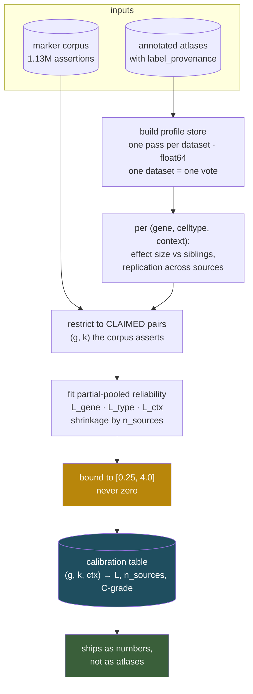
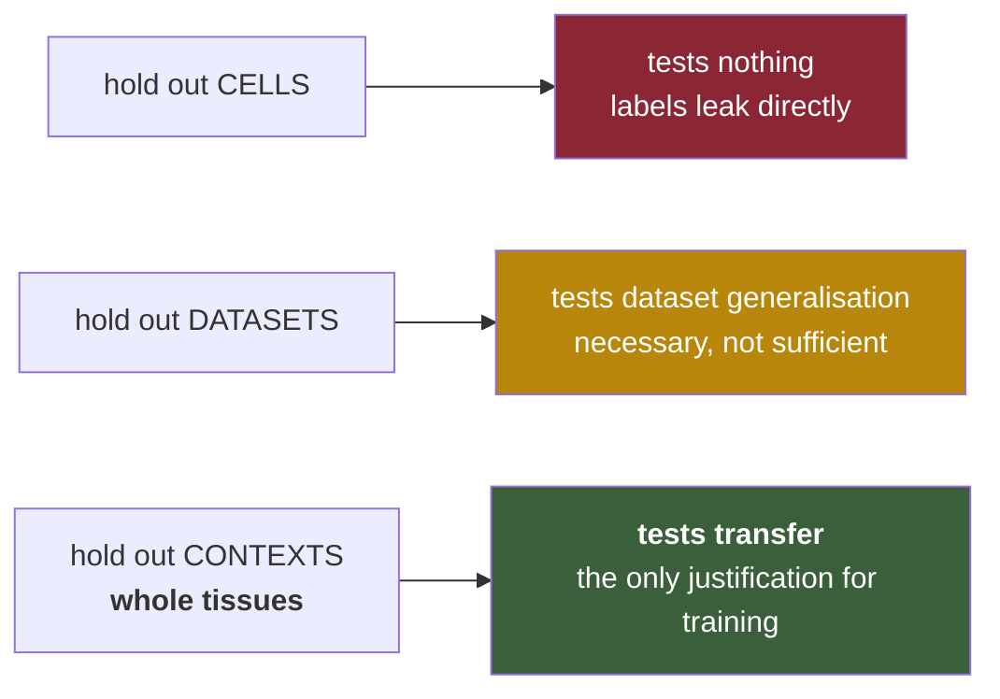

# Marker-weight training — is it helpful, and how would it be tested

Answering a question that turned out to have a prior question inside it.

---

## 1 · The corpus is no longer in the classifier

Checked against the code rather than remembered: **the current classifier contains no reference to
the marker corpus at all** — no `TIER_WEIGHT`, no `n_pmids`, no `evidence_tier`, no CellMarker.
Every weight derives from `store.mean`, the atlas-built profiles.

Five rounds of adversarial repair turned stream A into a **pure profile classifier**, and the
marker database that was the tool's founding premise fell out along the way. Nothing announced it;
each round was locally justified.

**This breaks the constraint the whole design was built on.**
scAnno is a general tool and cannot ship reference datasets.* A profile store is built from annotated atlases. Shipping the store is
still fine — it is numbers, not data — but a classifier that can **only** use profiles cannot work
at all in a context no atlas covers, whereas the corpus-backed design could.

| | curated corpus | atlas profile store |
|---|---|---|
| species × tissue contexts covered | **96** with ≥50 tier-1/2 assertions | far fewer, and unmeasured |
| a context with no atlas | works, on literature markers | **cannot run** |
| provenance | traceable to PMIDs | traceable to datasets |
| validated against expression | no — 93.5% is algorithm-derived | yes, by construction |

So the question *"is marker-weight training helpful?"* is really: **how does the corpus come back,
and does training earn its place when it does?**

## 2 · The two answer different questions, which is why both are needed

- **The corpus** says which genes are *claimed* to mark a type. Broad, literature-grounded,
  unvalidated.
- **The store** says how a type *actually* expresses genes. Direct evidence, narrow coverage.

Training is the bridge, and its value is one specific thing:

> **Cross-context transfer.** The store can only speak about `(celltype, context)` pairs it has
> observed. A trained corpus weight carries what was learned about a gene's reliability *elsewhere*
> into a context where no atlas exists.

If `C1QA` is a reliable macrophage marker across lung, liver, kidney and blood atlases, that is
evidence it is a reliable macrophage marker in heart — where the corpus has 618 curated assertions
and no atlas. **That transfer is the entire justification for training**, and it has never been
tested.

## 3 · Is it helpful? — measured, 2026-08-12

Three arms, same gene background, same clusters, same rooted tree, same walk. **Only the weight
source differs.**

| arm | node weights |
|---|---|
| **A** | corpus only — `tier × log1p(PMIDs)`, no atlas profiles at all |
| **B** | corpus × reliability learned from atlas profiles, bounded [0.25, 4.0] |
| **C** | atlas profiles only — the current design |

### Result on the independent set (pbmc68k, FACS labels, 765 genes)

| arm | correct | truncated | **WRONG** |
|---|---|---|---|
| A · corpus flat | 7 | 1 | **2** |
| **B · corpus × learned** | **9** | 0 | **1** |
| C · profiles only | 8 | 2 | **0** |

**B beats A: 9 correct against 7, one error against two.** The falsification criterion set in
advance — *if B does not beat A, training is not helpful* — is met.

### The prediction that makes this more than a post-hoc improvement

Arm A's two errors were **both sibling confusions**: `CD8+ Cytotoxic T → NK cell` and
`Dendritic → Monocyte`. The corpus asserts overlapping marker sets for siblings and has no way to
say which gene separates them, so a contrast-conditioned weight was predicted — *before running
arm B* — to fix exactly those.

It fixed exactly those, plus one truncation:

| population | A | B | |
|---|---|---|---|
| CD8+ Cytotoxic T | Lymphoid/**NK cell** | Lymphoid/**T cell** | ✅ predicted |
| Dendritic | Myeloid/**Monocyte** | Myeloid/**Dendritic cell** | ✅ predicted |
| CD4+/CD45RA+ Naive T | Lymphoid *(truncated)* | Lymphoid/T cell | ✅ resolved deeper |
| **CD34+** | UNRESOLVED *(correct)* | **Megakaryocyte** | ❌ **regressed** |

### The regression matters and generalises

Training made the **novel-type** case worse. CD34+ progenitors — a type with no store profile —
went from correctly withheld to confidently `Megakaryocyte`.

That is not a bug in the fit; it is what sharpening does. **Reliability weights increase confidence
among the siblings they were trained on, and a cluster belonging to none of them is pushed harder
toward one of them.** Any accuracy gain from training is therefore paid for partly in novelty
detection — which is already this design's weakest point.

### What this does and does not establish

- ✅ Training helps, on an independent dataset, in the way and on the cases predicted in advance.
- ✅ The corpus alone **can carry a context with no atlas** — arm A reaches 7/10 where the current
  profile-only design cannot run at all.
- ✅ A and C are **complementary**, not ranked: A got `CD19+ B` where C abstained; C got the two
  siblings A confused. That is the argument for using both and treating disagreement as signal.
- ❌ **This is dataset transfer, not context transfer.** Both datasets are human blood. The claim
  that justifies building this — train on lung, liver, kidney; annotate heart, where no atlas
  exists — remains untested and needs atlases this project does not have.
- ❌ Ten populations, one tissue, all common types.
- ❌ Training costs novelty detection, and that cost has not been bounded.

**Verdict: build it, and run the context-transfer experiment in §6 before trusting it.** Dataset
transfer is a necessary condition and it passed; it is not the sufficient one.

## 3b · The reordered marker set is the output, not a by-product

The classifier computes reliability, multiplies it into `W`, and **discards it** — throwing away
the only part of the calculation that is a scientific claim. The trained weights should be emitted
as a **marker panel reordered by measured discriminative power**, with its disagreement against the
citation ordering made explicit.

What makes that a finding rather than a table: it is re-derivable by anyone with the same atlases;
it carries effect sizes and replication counts, not just an order; it **names** what moved; and a
panel whose order does not change is a null result reported as one.

### Run on Human/Blood — 4,189 (node, gene) rows

Rank correlation between the citation ordering and the data ordering, per node:

| node | claimed markers | ρ (literature vs data) |
|---|---|---|
| Lymphoid | 784 | 0.78 |
| NK cell | 152 | 0.76 |
| Monocyte | 370 | 0.72 |
| **Dendritic cell** | 872 | **0.60** |

The panels move substantially, and the movement has one dominant, interpretable pattern.

### The finding: the corpus's panels are contaminated with cross-lineage markers

| node | demoted — literature top 20%, data says weak |
|---|---|
| **B cell** | **CD3E**, TBX21, PTPRC, MKI67, CD38, CD27, CD5, CCR7 |
| **NK cell** | **CD3D, CD3E, CD8A**, KLRK1 |
| **Monocyte** | **CD1C**, HLA-DRB1, CCR2, SELL, IDO1 |
| **Dendritic cell** | **CD14, CD68, CD163, CSF1R, CX3CR1, SIGLEC1** |

Every one of those is either a **marker of a different lineage** (CD3D/CD3E/CD8A are T cell genes
demoted from B and NK panels; CD1C is dendritic, demoted from monocyte; CD14/CD68/CD163/CSF1R are
monocyte-macrophage, demoted from dendritic) or **pan-immune and therefore useless for
discrimination** (PTPRC is CD45; MKI67 is proliferation, not identity).

**That is the finding.** The corpus aggregates across papers using different cell-type definitions,
so its panels accumulate markers from neighbouring lineages. The data separates lineage-specific
from shared, and it does so consistently across four independent nodes without being told what a
lineage is.

It is also the mechanism behind arm B's improvement: the two errors it fixed were `CD8 T → NK` and
`Dendritic → Monocyte`, and the demotion lists above are exactly the cross-lineage contamination
that caused them.

Meanwhile the top of each data-ordered panel recovers the canonical markers unprompted — B cell:
`CD19, CD79A, CD79B, TCL1A, BANK1`; NK: `NCAM1, GNLY, KLRF1, GZMB, KLRD1`; monocyte:
`CD14, FCGR3A, S100A8, S100A12, CD163`; DC: `CLEC4C, LILRA4, CD1C, FCER1A`.

### The promotions are weaker, and unevenly so

`E5/C1` promotions look real where the store has cells — NK gained `KIR3DL2, SH2D1B, CLIC3, IFNG,
CCL3`, all genuine NK genes with no strong citation weight in this corpus. But the dendritic-cell
promotions (`ARL6IP6, TMEM109, TMEM19, PAFAH2, OGT`) read as housekeeping, and that profile comes
from **37 cells**. **Promotion quality tracks the store's cell count for that type**, which is a
constraint on when the promotion half of the C ladder can be trusted at all.

### What must ship with it

One row per `(context, node, gene)`: citation weight, learned `L`, posterior weight, both ranks,
the rank delta, `n_sources`, and the verdict. The demoted rows keep their prior weight — flagged,
never deleted — because a marker that fails to replicate may be failing on an assay
bias shared by every atlas in the set, and a silent demotion is indistinguishable from a discovery.

**Caveat that bounds all of the above:** one tissue, one training dataset, eight cell types. The
*pattern* — cross-lineage demotion — is consistent across four nodes and mechanistically explains
a measured classifier improvement. The *specific lists* are a demonstration, not a validated
resource.

## 4 · What is trained

Not a weight per `(gene, celltype, context)` — that cannot transfer, because a context unseen at
training time has no entry. **Partial pooling**, so the model degrades gracefully toward what it
does know:

```
reliability(g, k, ctx)  =  L_gene(g)  ×  L_type(g, k)  ×  L_ctx(g, k, ctx)
                            ↑             ↑                ↑
                    is this gene ever   does it mark k    …in THIS tissue
                    a reliable marker?  across contexts?   (only where atlas exists)
```

Each factor is estimated with shrinkage toward the level above it, so a `(gene, celltype)` pair
seen in twenty contexts asserts strongly, one seen in a single context is pulled toward the
gene-level prior, and an unseen context falls back to `L_gene × L_type` — which is exactly the
transfer case.

The final weight remains an empirical-Bayes posterior on the citation prior:

```
w  =  w_bib(tier, n_pmids)  ×  reliability(g, k, ctx)      clipped to [0.25, 4.0]
```

**Never zero.** Driving a weight to zero removes a marker from every future annotation, and the
ones at risk are the rare, lightly cited markers that are nonetheless the only validated marker for
their type — exactly what an unbounded fit deletes.

## 5 · The training design



## 6 · The splits — and only the third one answers the question



**The decisive experiment.** Train on every context *except* one. Annotate that context using only
the corpus plus transferred weights — no atlas profiles for it, which is the situation the tool
faces in the 66 contexts with thin curation. Compare three arms:

| arm | weights |
|---|---|
| **A** | flat corpus — tier × log1p(PMIDs), untrained |
| **B** | corpus × transferred reliability (`L_gene × L_type`) |
| **C** | ceiling — full profile store for that context, as if an atlas existed |

**If B does not beat A, training is not helpful and the corpus should be used flat.** That is the
falsification criterion, stated before the experiment rather than after it. B approaching C would
mean transferred knowledge substitutes for a missing atlas, which is the strongest possible result
and the one worth building for.

Leave-one-context-out across the well-covered contexts gives ~96 folds at negligible cost per fold.

## 7 · Circularity, which gets worse with scale

Most atlas labels are marker-derived, and many used CellMarker. **Training corpus weights on
CellMarker-derived labels measures agreement with prior practice, not truth**, and volume looks
like confirmation.

Holding out cells does not break the loop. Holding out datasets does not break it either if every
dataset was annotated the same way. So promotion and training both gate on `label_provenance`:

| provenance | counts as clean? |
|---|---|
| sorted / genetic / hashing | **yes** — a different measurement modality |
| CITE-seq, multimodal | **yes** |
| expert-curated, markers not from this corpus | partial, counted separately |
| marker-derived | **no** |
| unknown | **no** — never assumed clean |

**≥3 label-clean sources** to influence a weight. The PBMC test already on file happens to satisfy
this: `pbmc68k`'s labels are FACS gates, not transcriptomic inference.

## 8 · What must be true before any trained weight gates anything

The standing rule from [PRINCIPLES.md](PRINCIPLES.md) §3, applied here in advance:

> **No statistic gates an output until it has been shown to separate correct from incorrect calls
> on held-out data, reported as an AUC beside the gate it justifies.**

Concretely, the trained weights must clear all four before shipping:

1. **argmax-versus-call** — accuracy with and without the trained weights. Lower accuracy is a
   defect on the front page, not conservatism.
2. **held-out-context transfer** — arm B beats arm A (§6), or it does not ship.
3. **self-test cannot certify.** Proven twice: negative weights were invisible on the self-test and
   cost two errors on independent data; the confidence gate looked reasonable and destroyed three
   correct calls. **Every claim is made on held-out contexts.**
4. **disagreement is reported, not resolved.** A heavily cited marker the data does not support
   (E1/C4) keeps its prior and is flagged. Silent demotion is indistinguishable from discovery.

## 9 · Cost, and what to do first

Training is cheap — the store pass already computes the effect sizes, and the fit is a shrinkage
estimator over a table, not a model over cells. The expensive part is assembling atlases with
declared provenance.

**But the first thing to build is not the training.** It is restoring the corpus to the classifier
at all, since the current one cannot run in a context without an atlas. The order:

| | | status |
|---|---|---|
| 1 | **put the corpus back** as the weight source where profiles are absent | ✅ **done** — `corpus_weights.py`; arm A runs where the profile-only design cannot |
| 2 | baseline: flat corpus weights — arm A | ✅ **done** on two datasets; 7/10 on the independent one |
| 3 | fit reliability, run arm B | ✅ **done** on dataset hold-out; **B > A**, 9 vs 7 correct |
| 4 | **leave-one-CONTEXT-out** — the experiment that justifies training | ❌ **blocked on atlases** for tissues beyond blood |
| 5 | bound the novelty cost training introduces | ❌ not started |
| 6 | ship only if B > A on held-out **contexts** | — |

Steps 1–3 landed and the result was positive. **Step 4 is the one that matters and it is the one
still missing** — everything measured so far is within a single tissue. The hybrid the results
point to is: profiles where the store has them, corpus where it does not, reliability transferring
between the two, and disagreement between arms A and C reported rather than resolved.
